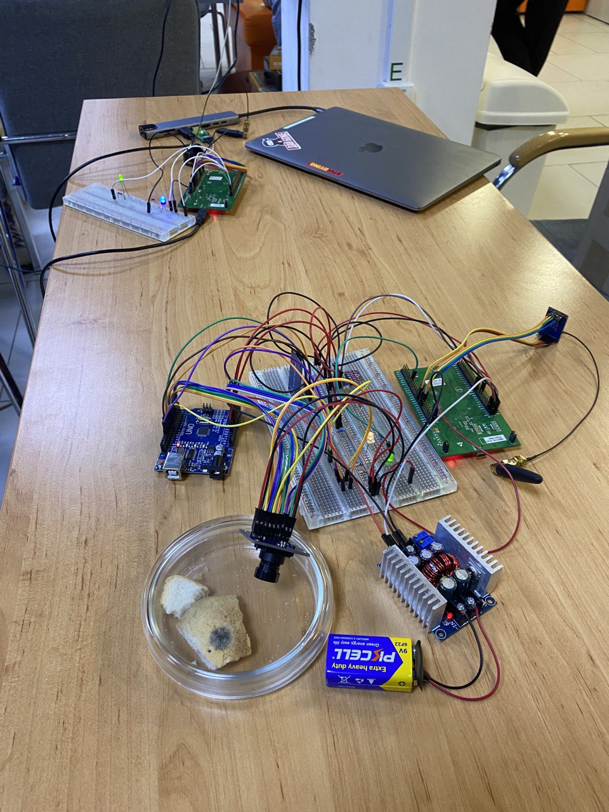

# Satellite 
## Prototype for mold research

### Team:

- Students: 
  - [Nazar Demchuk](https://github.com/frezario)
  - [Vitalii Petrychko](https://github.com/Vitalik001)
  - [Anastasiia Senyk](https://github.com/anastasiasenyk)
  - [Matthew Prytula](https://github.com/MatthewPr12)

- Mentors: 
  - Denys Levchunets
  - Oleg Farenyuk

## Details:
### 1. Satellite (remote):
   - STM32411e-disco
     - Lora Module
     - Antenna
     - BME
     - Photoresistor
     
   - Arduino Uno
     - Lora Module
     - Camera OV7670
     - SD reader + SD card (32Gb)
   
   - Battery
   - DC-DC controllable buck converter (9 Volt - 5 Volt) 

### 2. Local:
   - STM32411e-disco
      - Lora Module
   - Physical uart
   
